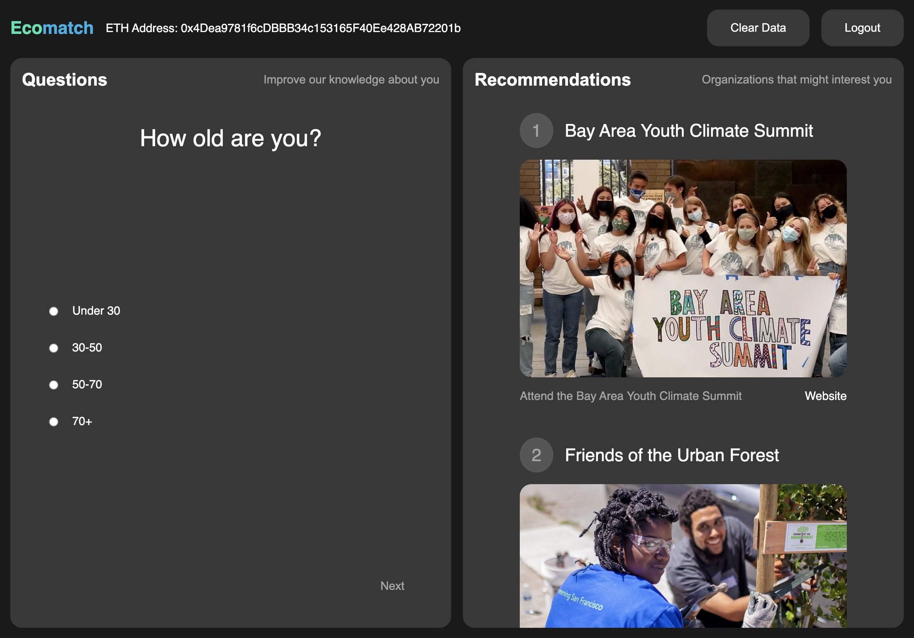

# Ecomatch

Find climate organizations that match your preferences with full control of your data.

## Summary

Ecomatch consists of two panels: _Questions_ and _Recommendations_.

- The _Questions_ panel asks you a series of questions about your preferences for climate organizations, and stores your answers with Kepler through SpruceId.
- The _Recommendations_ panel shows you a list of climate organizations that match your preferences.

## Overview

Ecomatch is a web application built with [SvelteKit](https://kit.svelte.dev/) and [SpruceId](https://spruceid.dev/).

## Usage

```bash
git clone https://github.com/Ashwagandhae/ecomatch.git
npm i
npm run dev
```

License: MIT
